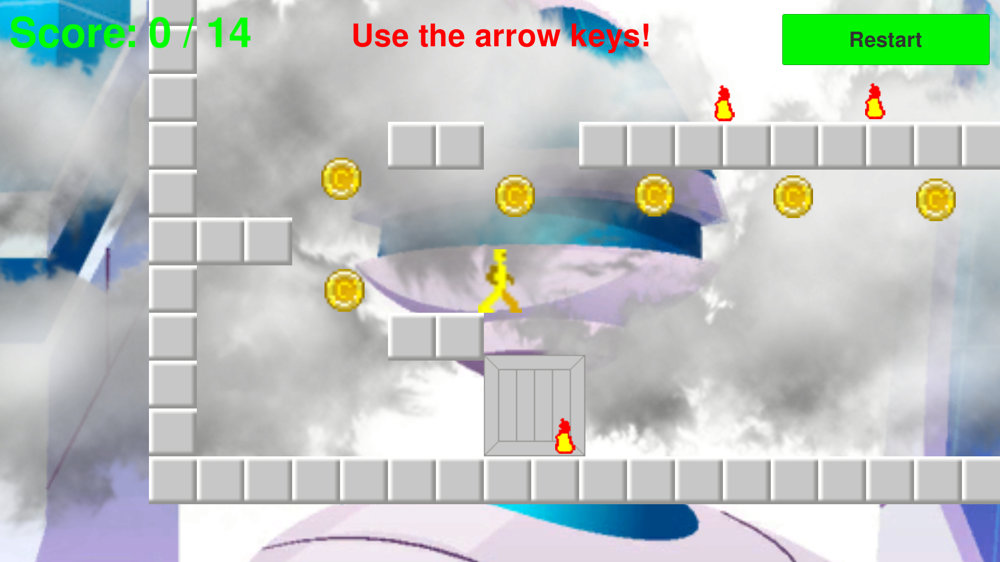
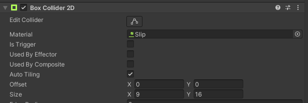
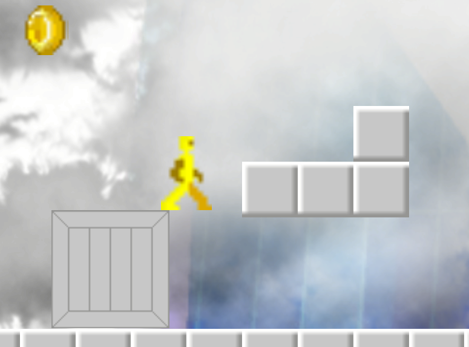
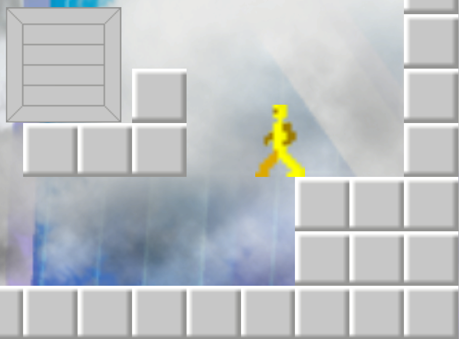
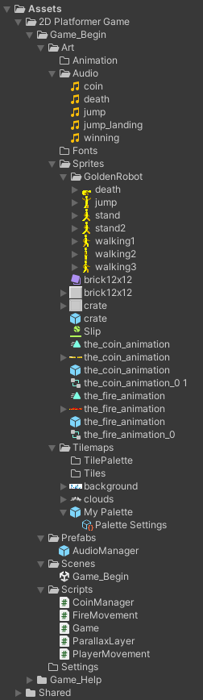

# How I fixed the 3 rubric items I failed

## 1. Player Visibility:

**Problem:** The character sprite is difficult to distinguish against the cloudy background due to low contrast. Please adjust the contrast so that the player as a whole remains clearly visible throughout the entire gameplay.

**Solution:**

I changed the character from Silver Robot to Golden Robot. Now the robot is golden and constrasts better with the gray clouds.

Moreover, the script is slightly more coherent, thanks to Golden Robot. Golden Robot has to collect gold coins in order to fix its body parts made of gold. 
Fires can actually damage electronics. Only in movies, robots are bullet-proof and fire-proof.
Blocks and the crate are made of silver.

## 2. Physics & Colliders:

**Problem:** The player currently floats in mid-air at the edge of the platforms. Ensure the physics settings (Rigidbody2D and Collider2D) are configured properly so the character falls naturally to the ground when reaching the end of a surface.

**Solution:**

This problem was already solved in my previous project submission. However, due to the low contrast between the robot and the clouds, it was hard to notice that this problem was already solved. In my previous project submission, I drew the robot with the legs slightly open in the resting positions. So, the robot sprite occupies all the floor of the 11 x 16 pixel grid, making the robot less likely to appear to be floating in the air:

 

In this project submission, I additionally reduced the size of the Box Collider 2D from 11 x 16 pixels to 9 x 16 pixels, making the robot less likely to appear to be floating in the air:

So, now this is the maximum amount of pixels you can approach to the edges. If you approach further to the edges, you will fall.

 

## 3. Project Folder Structure:

**Problem:** The Game_Begin folder and all of its subfolder must be fully expanded in your Unity Project Window screenshot.

**Solution:**

I read this document about the project window and I changed my Unity Project Window from Two Column Layout to One Column Layout. 

The Project window 
https://docs.unity3d.com/6000.1/Documentation/Manual/ProjectView.html

And then I fully expanded all the subfolders in my project. The file `UnityProjectWindow.png` looks better now, as you requested:

Thanks for your time, patience, and wise advice.
